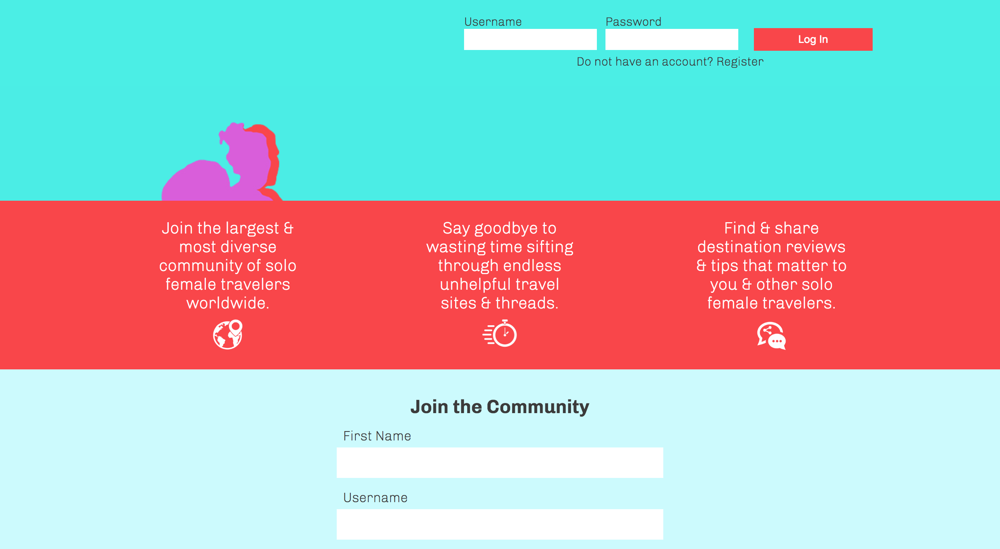
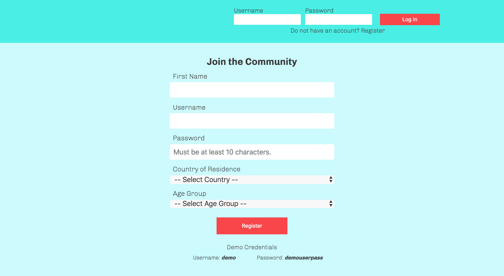
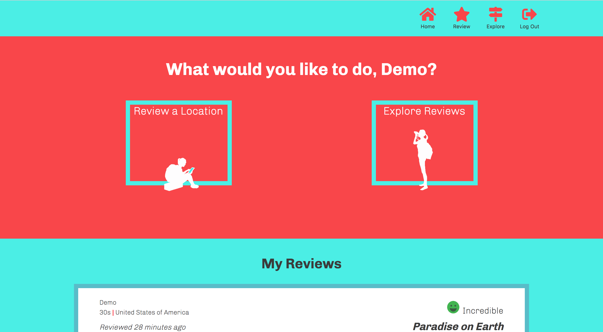
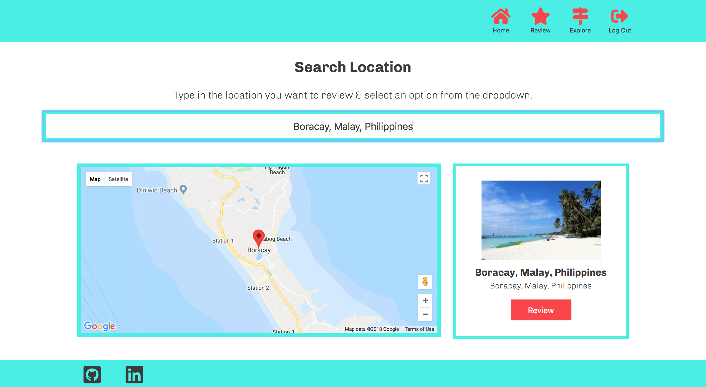
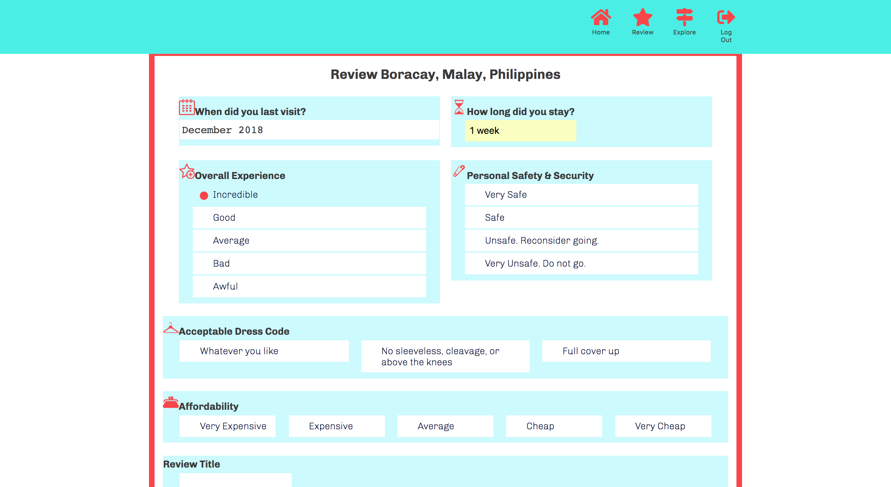
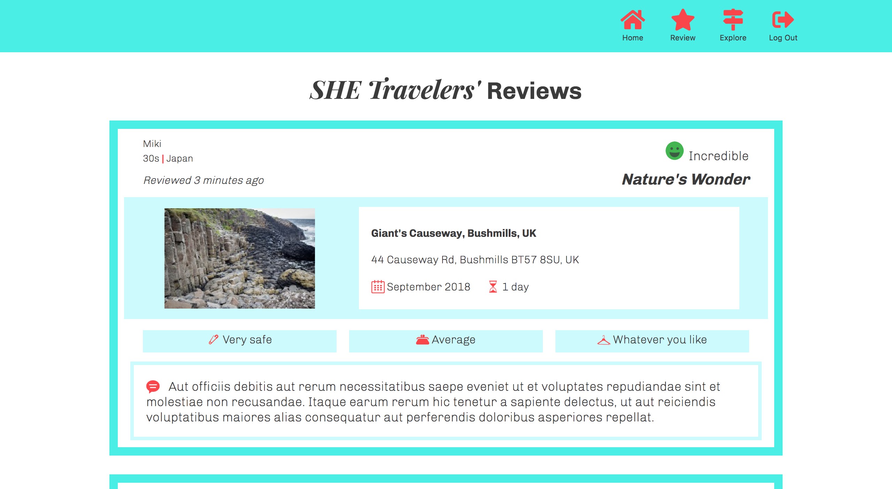

# _SHE Travels_

**_[SHE Travels](https://shetravels.netlify.com/)_** is a full-stack travel review web application for solo female travelers by other solo female travelers. This is a one-stop app for solo female travelers to share their experiences and get the information that matters most to their traveling style.

## Demo

- [Live Demo](https://shetravels.netlify.com/)

## Screenshots

#### Landing Page

#### Homepage
Upon successful login, users are directed to their SHE Travels' homepage. Users are greeted with a choice to explore reviews or add a new review. The user's own reviews are also displayed on the homepage.

#### Location Search
Using Google Maps API, users can search for the location they wish to review. Upon selection of a location from the dropdown, a map of the location, picture, and formatted address appear. If the user wishes to review the location, they simply click on the review button and they will be directed to the Review Form page.

##### Review Form

##### Explore Reviews
All SHE Travels users' reviews appear on this page. 

## Technologies Used

### Front End

* React
* Redux
* Axios
* React Router
* HTML5/CSS3
* CSS3

### Back End

* Node.js
* Express.js
* MongoDB
* Mongoose
* MVC framework
* Bcryptjs
* JWT

## Powered by

* Location search is powered by Google Maps API

## Contributor

* Ola Assem

## Acknowledgements

* Jon Oyanguren & Thinkful
