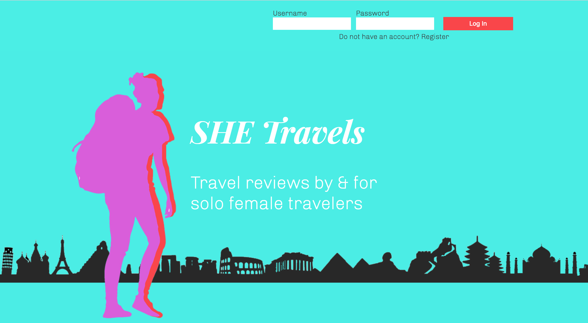

# _SHE Travels_

A goal without a plan is a wish. **_[bringit](https://bringit-app.herokuapp.com/)_** is a full-stack web application that provides users with both daily motivational and planning tools to conquer their fitness goals.

## Demo

- [Live Demo](https://shetravels.netlify.com/)

## Screenshots

#### Landing Page

#### Sign-up & Log-in Modals

#### Homepage
Upon successful login, users are directed to bringit's homepage. Users are greeted with a random inspiring fit quote. For more inspiration, just click on the #fitspire_me button!

#### Fitweek
The fitweek section is where users can add, view, edit, and delete their customised day plans for each day of the week.

#### Day Plan Form
To add (and edit) a day plan, users go through a quick 3-step form:

##### 1. Categories
Users may post, delete, and select new categories.

##### 2. Activity
Users may post activity details.

##### 3. Exercises
Users may post, delete, edit and select exercises before submitting their customised day plan.

#### Fit Goals
Users may add, edit, delete, _and_ check their fit goals as completed. To see how far they've come, users can also view their fit goal history log.

## Technologies Used

### Front End

* HTML5
* CSS3
* JavaScript
* jQuery

### Back End

* Node.js
* Express.js
* MongoDB
* Mongoose
* MVC framework
* Bcrypt
* JWT

## Contributor

* Ola Assem

## Acknowledgements

* Jon Oyanguren & Thinkful
